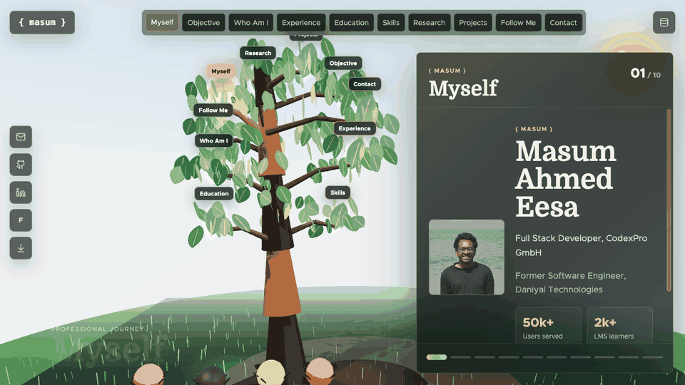

# Living Tree Portfolio

<p align="center">
  
</p>

<p align="center">
  <strong>A cinematic portfolio experience where a professional journey grows as a living 3D tree.</strong>
</p>

<p align="center">
  <a href="https://react.dev/"></a>
  <a href="https://threejs.org/"></a>
  <a href="https://vite.dev/"></a>
  <a href="https://greensock.com/gsap/"></a>
  
</p>

---

## Overview

This is not a conventional resume page. It is an interactive, garden-like portfolio built with React, Three.js, React Three Fiber, Drei, and GSAP. The main interface is a large 3D tree: each branch and leaf represents a part of the profile, from identity and objective to experience, education, skills, research, projects, social links, and contact.

Visitors explore by clicking leaves. The camera moves, the tree responds, and the selected story opens in a polished content panel. For maintainers, the portfolio also includes a built-in static content studio at `/#/admin`, so content can be edited, previewed, copied, exported, and committed without adding a backend.

> **Design intent:** make a portfolio feel memorable, technical, and personal while staying forkable for open-source users.

## Live Demo

- Portfolio: [https://masumahmedeesha.github.io](https://masumahmedeesha.github.io)
- Content Studio: [https://masumahmedeesha.github.io/#/admin](https://masumahmedeesha.github.io/#/admin)

The GIF above shows the full draft flow: open the tree, enter the database editor, update a section title, save the preview draft, return to the portfolio, and see the tree/card result update immediately.

## Experience Highlights

- Cinematic 3D tree interface with branch-based navigation
- Hoverable and clickable leaf controls with animated focus states
- Camera movement, leaf focus, reveal transitions, and micro-interactions powered by GSAP
- Garden scene with land, grass, sky, sun, particles, ambient lighting, shadows, and insects
- Responsive desktop and mobile layouts
- Content cards for profile, objective, biography, experience, education, skills, research, projects, follow links, and contact
- Built-in static CMS for editing profile data without installing a database
- Safe media handling for local assets, online image/resume URLs, and draft uploads
- GitHub Pages deployment workflow included

## Tech Stack

| Layer | Tools |
| --- | --- |
| Interface | React, Vite, Lucide React |
| 3D Scene | Three.js, React Three Fiber, Drei |
| Motion | GSAP |
| Content | Static JSON database, React context |
| Deployment | GitHub Actions, GitHub Pages |
| QA | Node-based content/security test suite |

## Quick Start

```bash
npm install
npm run dev
```

Open the local Vite URL, usually:

```text
http://localhost:5173/
```

Open the content studio:

```text
http://localhost:5173/#/admin
```

Build and preview production:

```bash
npm run build
npm run preview
```

## Content Studio

The CMS is intentionally small and static. It does not require MongoDB, Postgres, Firebase, Supabase, or any extra service.

| Capability | Behavior |
| --- | --- |
| Main data file | `public/content/portfolio-content.json` |
| CMS route | `/#/admin` |
| Draft lifetime | Preview-only, until browser reload |
| Permanent changes | Export/copy JSON, replace the repo file, commit |
| Uploads | Draft-only data URLs unless you commit real assets |
| URL safety | Blocks unsafe schemes before save, copy, export, or render |

### Permanent Content Workflow

1. Run the project locally with `npm run dev`.
2. Open `/#/admin`.
3. Edit section titles, profile details, experience, education, skills, research, projects, social links, media, resume, or full JSON.
4. Click `Save Draft` to preview the change in the portfolio.
5. Before reloading, click `Export JSON` or `Copy JSON`.
6. Replace `public/content/portfolio-content.json` with the exported content.
7. Commit and push.

> **Important:** GitHub Pages is static. The CMS can preview changes in the browser, but it cannot permanently write to your repository. That is a feature, not a bug: the portfolio stays simple, portable, and safe to host.

### Media Rules

Media fields support:

- Repo-relative assets such as `/images/portfolio/demo.jpg`
- Online URLs such as `https://example.com/photo.webp`
- Draft uploads for images and resumes

Draft uploads reset on reload. For permanent media, add the asset to `public/` or use a stable online URL and export the JSON before reloading.

To hide the public CMS/database icon in production:

```bash
VITE_ENABLE_PUBLIC_CMS=false npm run build
```

## Customize For Your Own Portfolio

This project is designed to be forked.

1. Clone or fork the repository.
2. Replace the files in `public/images/` and `public/resume.pdf`.
3. Edit content through `/#/admin` or directly in `public/content/portfolio-content.json`.
4. Keep the existing section IDs unless you also update the rendering logic:

```text
name
objective
whoami
experience
education
skills
research
showcase
follow
contact
```

5. To add a new tree section, update:

```text
sectionOrder
treeNavItems
sections
src/components/ContentPanel.jsx
```

Tree leaf positions use a simple 3D coordinate:

```json
{
  "id": "skills",
  "label": "Skills",
  "position": [1.08, 0, -0.55],
  "tint": "#f497b6"
}
```

Use `position[0]` for left/right, `position[1]` for up/down, and `position[2]` for depth.

## GitHub Pages Deployment

The repository includes `.github/workflows/deploy.yml`.

The workflow currently deploys pushes to:

```text
stable-tree
main
```

To publish:

1. Push to one of the deploy branches.
2. Open GitHub repository `Settings` > `Pages`.
3. Set `Source` to `GitHub Actions`.
4. Run the workflow manually or push a new commit.

For a `username.github.io` repository, keep the base path as `/`.

For a project page such as `https://username.github.io/my-portfolio/`, add an Actions repository variable:

```text
VITE_BASE_PATH=/my-portfolio/
```

## Testing

Run the focused QA suite:

```bash
npm run test:qa
```

Run the full pre-publish check:

```bash
npm test
```

`npm test` runs the CMS/content/security checks and then builds the production bundle.

Current automated coverage includes:

- CMS visibility rules
- Content normalization
- Full JSON draft save path
- URL sanitization
- Online media URL validation
- Draft image/resume upload validation
- Data URL detection before copy/export
- Collection tab reordering
- Production build integrity

Recommended manual QA before publishing:

1. Click every tree leaf on desktop and mobile.
2. Confirm the selected leaf animates and the content panel updates.
3. Open `/#/admin`.
4. Edit at least one field, click `Save Draft`, and return to the portfolio.
5. Confirm the draft result appears without reload.
6. Test one online image URL and one resume URL.
7. Test draft upload behavior for a small image and a PDF.
8. Export or copy JSON, then reload and confirm drafts reset to the JSON database.

## Project Structure

```text
public/
  content/portfolio-content.json
  demo/portfolio-database-demo.gif
  images/
  resume.pdf
src/
  App.jsx
  components/
    ContentManager.jsx
    ContentPanel.jsx
    TreeExperience.jsx
  data/
    PortfolioContentContext.jsx
    portfolio.js
  utils/
  main.jsx
  styles.css
scripts/
  export-content.mjs
  qa-tests.mjs
.github/workflows/deploy.yml
```

## Performance Notes

The app keeps the portfolio visually rich while staying practical for static hosting:

- Vite code-splitting separates React, icons, GSAP, and the Three.js scene.
- The CMS and content panel are lazy-loaded.
- Heavy 3D chunks are not eagerly preloaded from the initial HTML.
- Static JSON content keeps deployment simple and cache-friendly.

## License

MIT. Fork it, personalize it, and make your own professional story feel alive.
